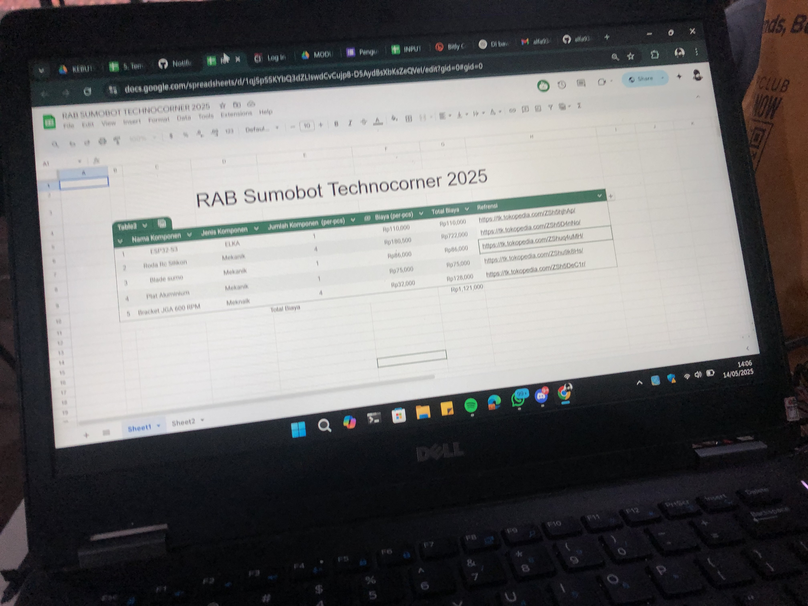

# Logbook Program 2025-05-15 

## [ Febrian ] 

### Bukti Kegiatan 📸

> ...

### Deskripsi Kegiatan 👨‍🏫

 review pembelajaran mengenai program, belajar motion profiling, belajar kinematik, dan juga pembacaan encoder 

### Masalah ❌
1. esp32 tidak bisa ke upload
2. mencari sumber belajar motion profiling
   
### Solusi 👍
1. tombol boot esp32 harus ditahan saat upload
2. mencari di berbagai sumber yang ada

---

## [ Raditya Satria Pratama ] 

### Bukti Kegiatan 📸

> Lorem ipsum dolor sit amet

### Deskripsi Kegiatan 👨‍🏫

 Update RAB, melakukan First Meet lengkap untuk lomba SumoBot team di Lab EIRRG dan juga Belajar mengenai mekanum dan encoder 

### Masalah ❌
1. Rab yang dibuat bengkak
2. belum clock configuration salah panggil fungsi pin nya beda

### Solusi 👍
1. Untuk sekarang belum menemukan solusi dari masalah RAB
2. harus lebih teliti lagi untuk kedepannya
---

## [ Brightly Padmohoetomo ] 

### Bukti Kegiatan 📸

> Lorem ipsum dolor sit amet

### Deskripsi Kegiatan 👨‍🏫

 Pembelajaran ulang materi awal magang yaitu materi encoder dan kinematika robot p2 

### Masalah ❌
1. Encoder Roda A tidak berfungsi (tidak dapat membaca nilai)
2. Laptop short-circuit
3. Kesalahan rumus kinematika
   
### Solusi 👍
1. Meminta tolong diperiksa dan diperbaiki oleh Elka
2. Jangan menyambungkan laptop dengan STM sebelum dipasangkan baterai ke robot
3. Memeriksa ulang arah putaran roda, dan menganalisa roda mana yang salah arah
---

## [ Darrel ] 

### Bukti Kegiatan 📸

> Lorem ipsum dolor sit amet

### Deskripsi Kegiatan 👨‍🏫

 Pembelajaran program dan riset mandiri client dan server 

### Masalah ❌
1. kendala di pembelajaran hari ini adalah tadi motor D sempat tidak terbaca encoder nya dan tadi punya radit fungsi jalan motor nya sempat tidak jalan

### Solusi 👍
1. cek ulang pin, timer, dan clock configuration nya
---

## [ Algi ] 

### Bukti Kegiatan 📸

> Lorem ipsum dolor sit amet

### Deskripsi Kegiatan 👨‍🏫

 Ngoding ethernet 

### Masalah ❌
1.tidak ada

### Solusi 👍
1. tidak ada
---

## [ Alfa ] 

### Bukti Kegiatan 📸

> Lorem ipsum dolor sit amet

### Deskripsi Kegiatan 👨‍🏫

 Mengajarkan ethernet module ke stm32 ke algi 

### Masalah ❌
1.tidak ada

### Solusi 👍
1. tidak ada
---
## [ Muhammad Miftah Faqih ] 

### Bukti Kegiatan 📸

> Lorem ipsum dolor sit amet

### Deskripsi Kegiatan 👨‍🏫

 Riset open CV dan juga melakukan pembelajaran encoder untuk asisten baru  

### Masalah ❌
1.Untuk riset aman sudah membuat 2000 dataset, untuk pembelajaran sempat terkendala salah pin

### Solusi 👍
1. untuk kedepannya lebih teliti lagi, agar kesalahan yg sama tidak terjadi
---
